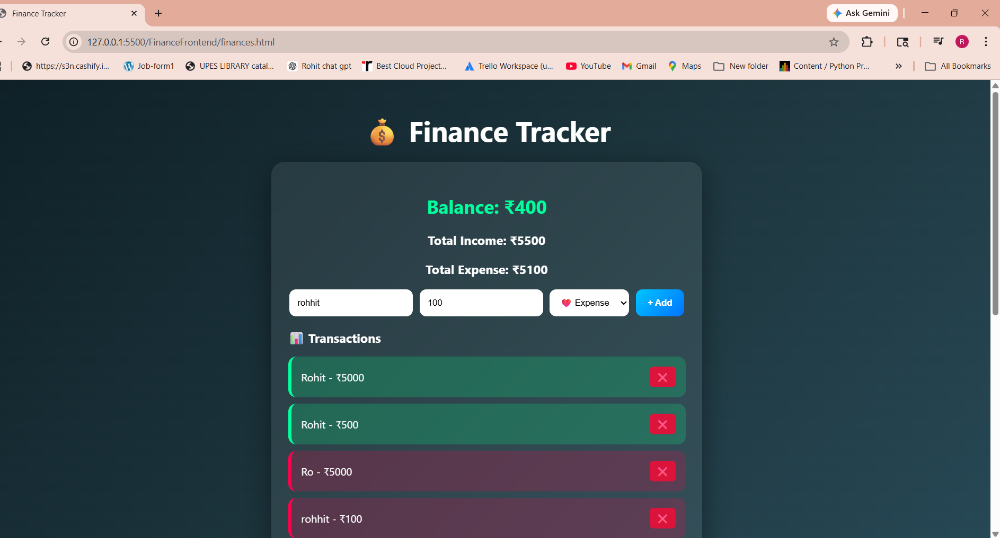
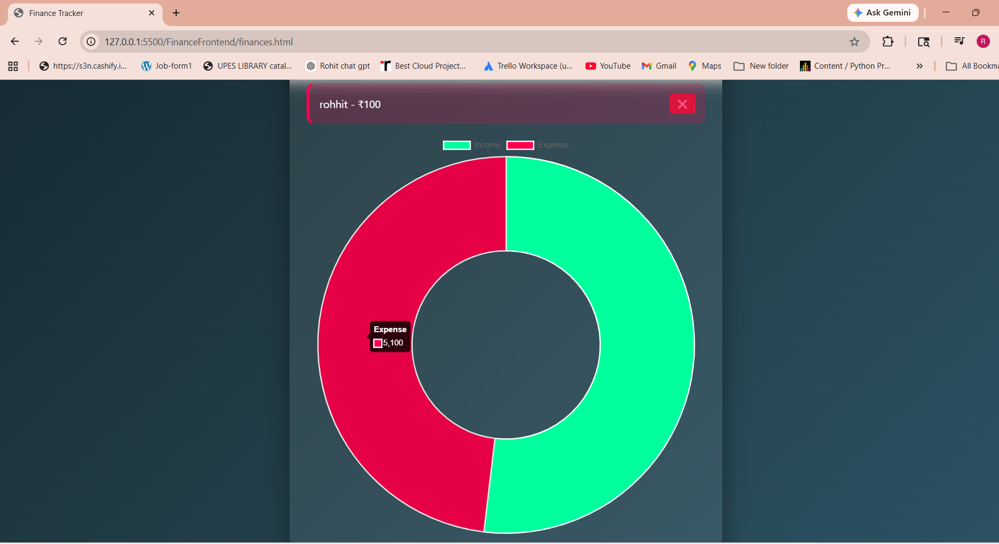
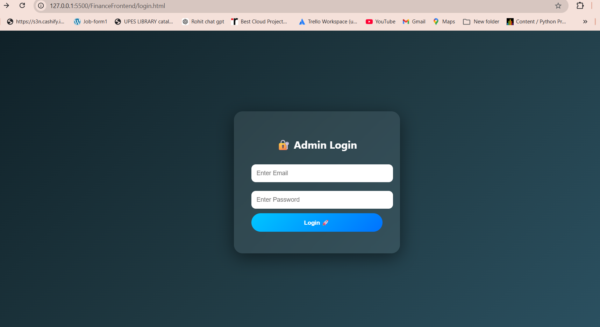
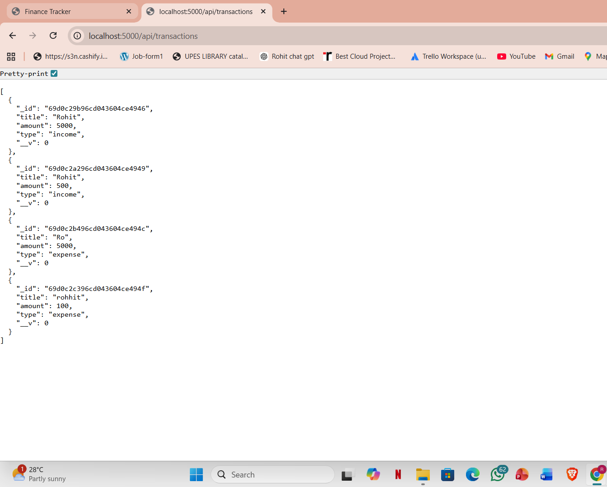

# 💰 Finance Tracker

A full-stack finance tracking web application that helps users manage income and expenses with a clean UI and real-time updates.

---

## 🚀 Features

* ➕ Add income & expenses
* 📊 Track balance dynamically
* 📈 Visual dashboard (graphs)
* 🔐 User authentication (if added)
* ⚡ Fast and responsive UI

---

## 🛠 Tech Stack

* Backend: Node.js, Express.js
* Frontend: HTML, CSS, JavaScript
* Database: MongoDB

---

## 📂 Project Structure

FinanceBackend/ → Backend API
FinanceFrontend/ → Frontend UI
img/ → Screenshots

---

## ▶️ Run Locally

```bash
npm install
npm start
```

---

## 🌐 Future Improvements

* Add user login/signup
* Deploy on cloud (Render/Vercel)
* Add mobile responsivenes
* 
## 📸 Screenshots
## 📸 Screenshots

### 🏠 Home UI


### 📊 Dashboard


### 🔐 Login Page


### ⚙️ Backend Running


---

## 👨‍💻 Author

Rohit Sharma
